---

<!-- _class: image -->

---

---

<!-- _class: image -->

---

<!-- _class: image -->
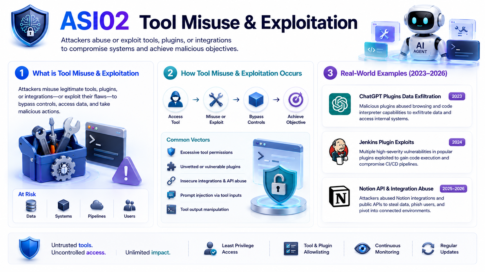

---

---

<!-- _class: image -->
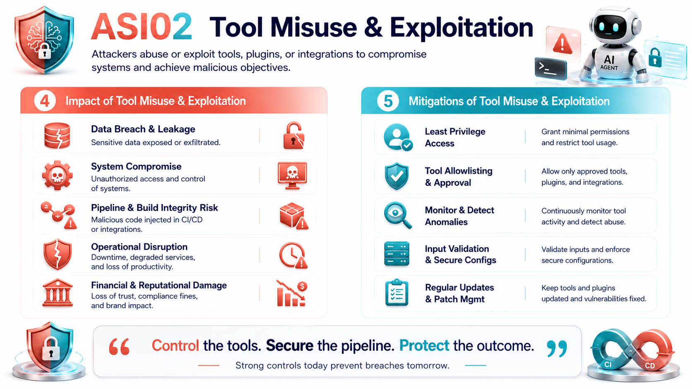

---

---

<!-- _class: image -->

---

---

<!-- _class: image -->

---

<!-- _class: image -->
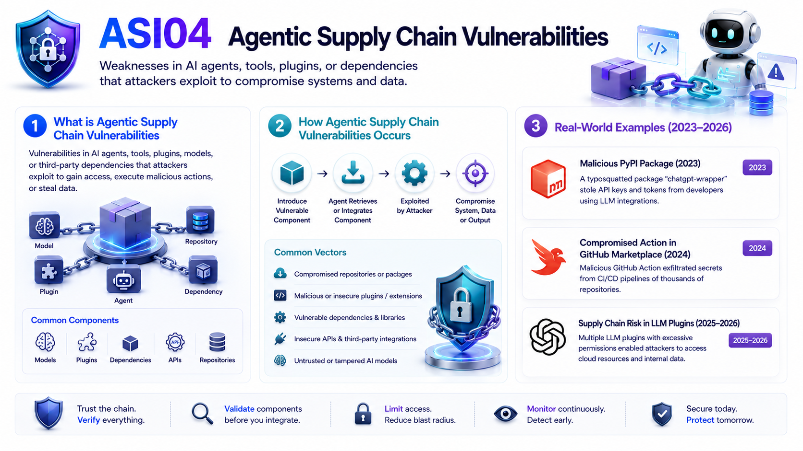

---

<!-- _class: image -->
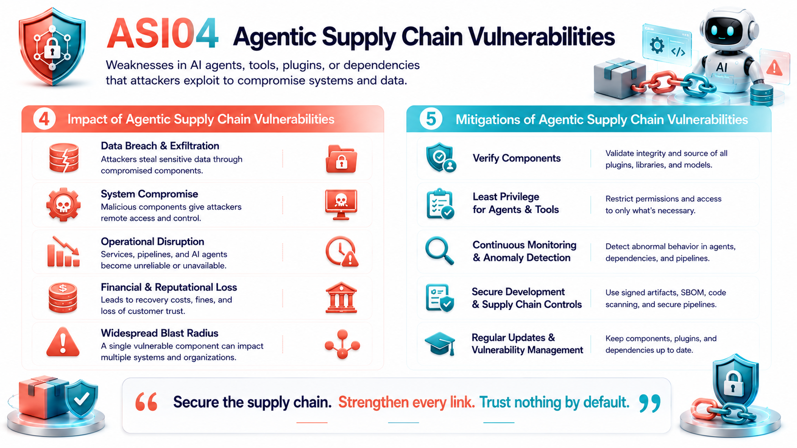

---

---

<!-- _class: image -->
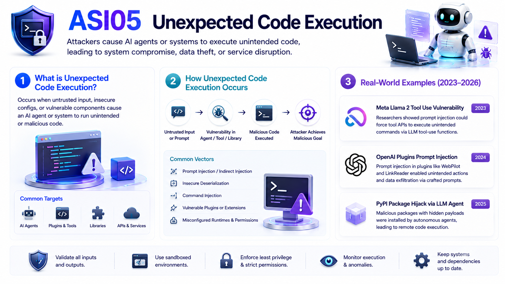

---

<!-- _class: image -->
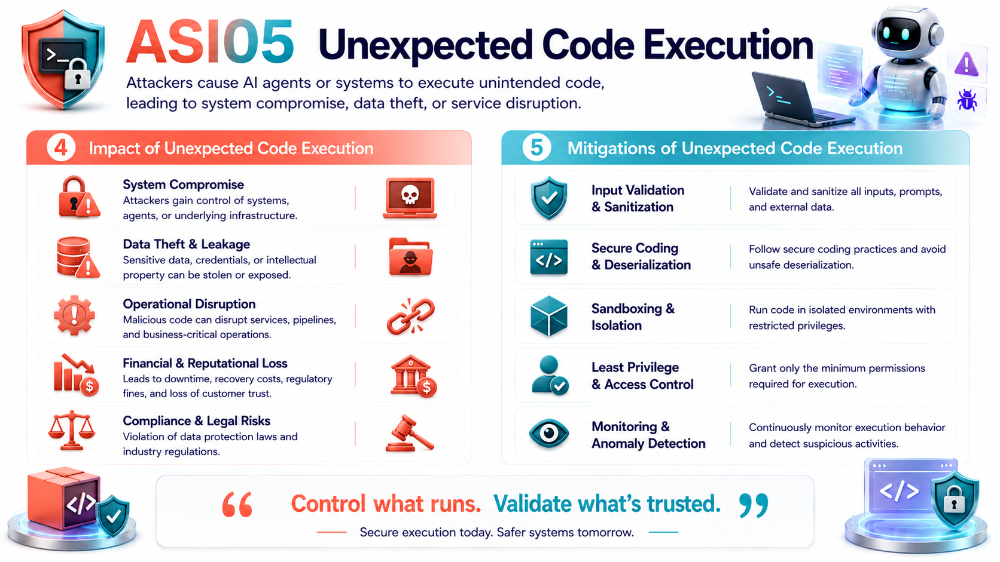

---

---

<!-- _class: image -->
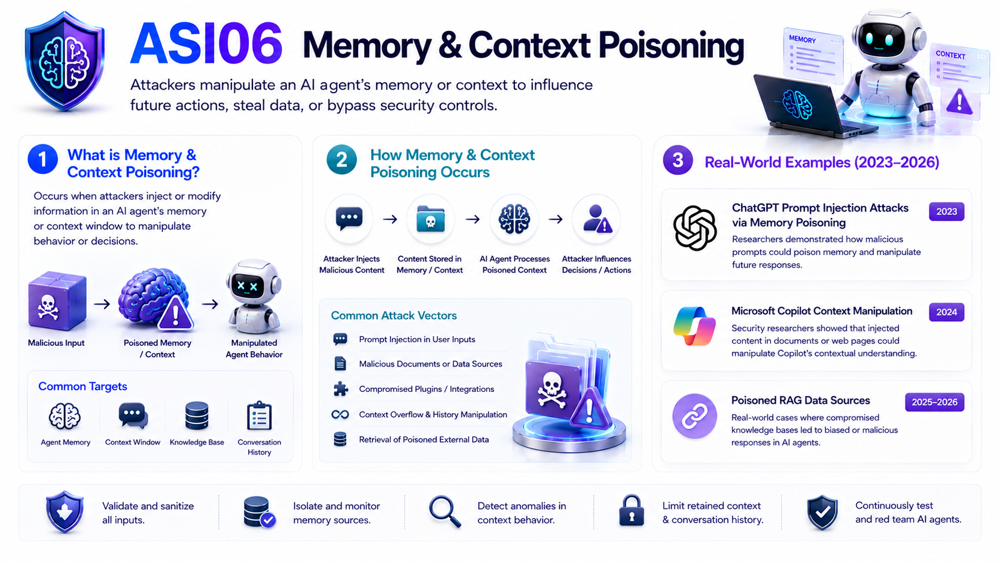

---

---

<!-- _class: image -->
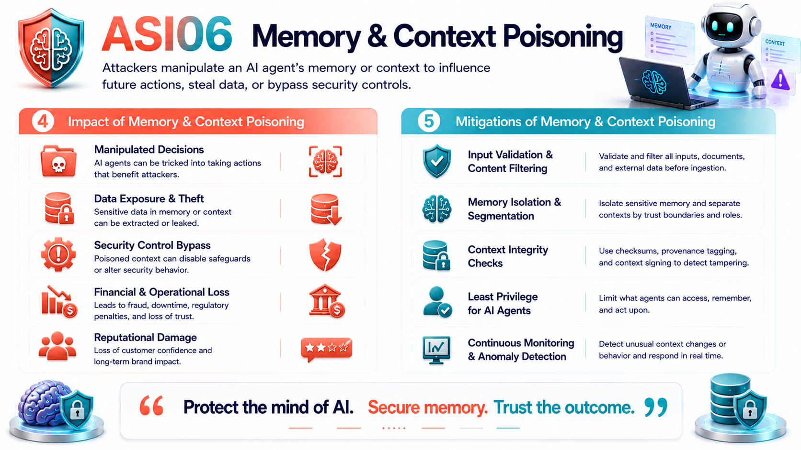

---

---

<!-- _class: image -->
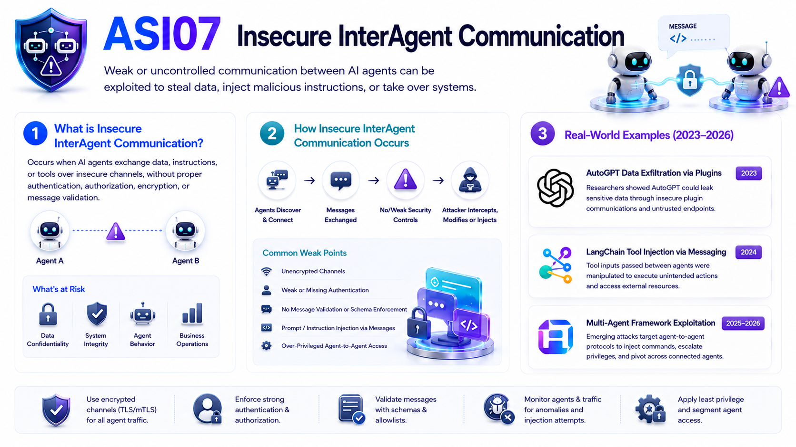

---

<!-- _class: image -->
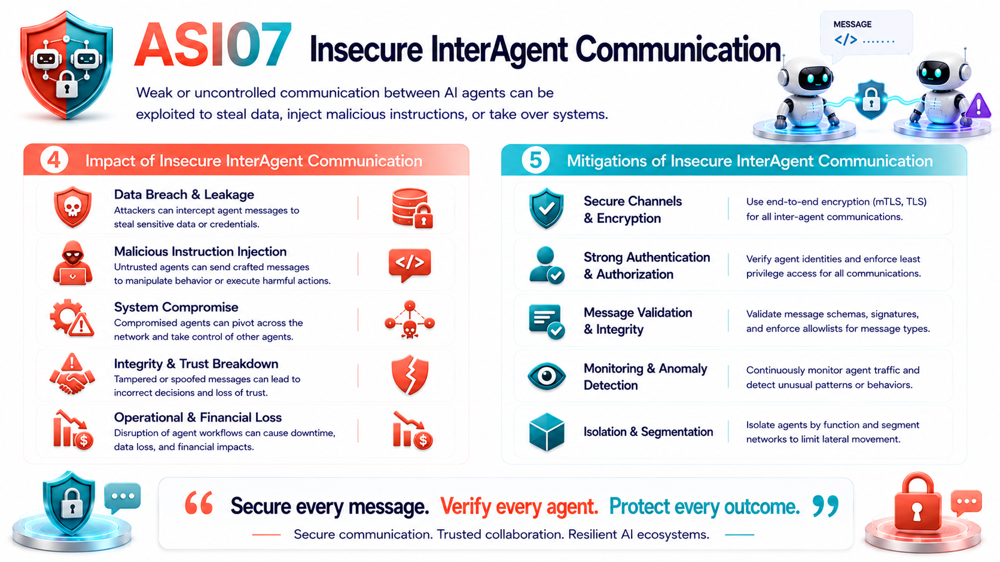

---

<!-- _class: image -->
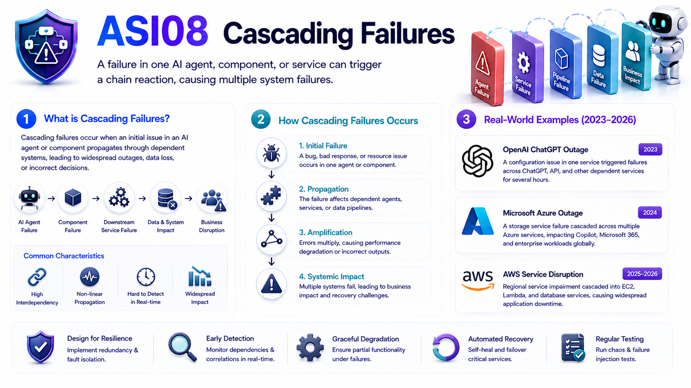

---

---

<!-- _class: image -->
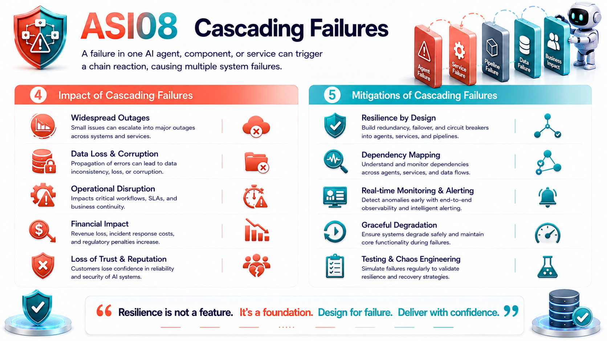

---

<!-- _class: image -->

---

<!-- _class: image -->

---

---

<!-- _class: image -->

---

<!-- _class: image -->
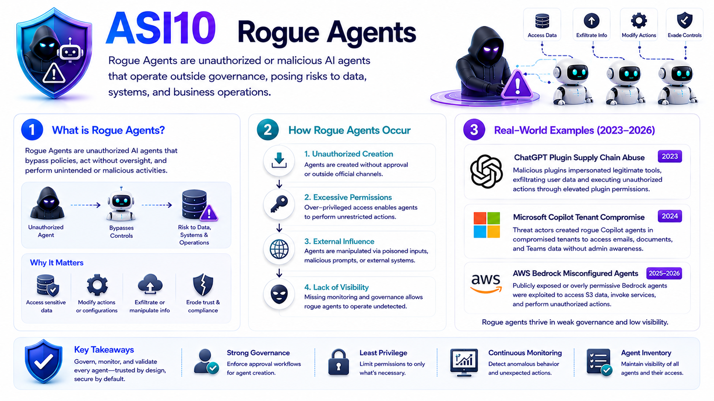

---

---

<!-- _class: image -->
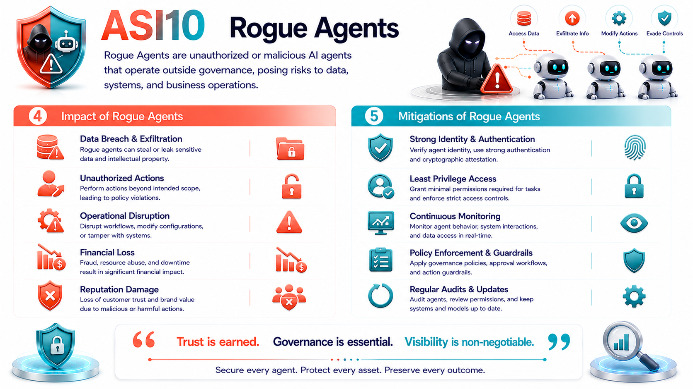

---
